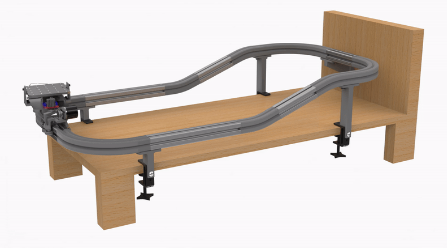

# ME461-Vehicular-Lab-Automation-Device
<b>Boston University ENG 2023: Senior Capstone</b> 

     

Team VLAD Members:

- Adam Bahlous-Boldi
- Miguel Ianus-Valdivia
- Kyle Fieleke
- Vlad Pyltsov
- Abin Binoy George

## Motivation and Goals
This was our senior design project at Boston University, with the main objective of showcasing our skills as an engineer. This project was proposed by Dr. Keith Brown. More information on the project details and our solution can be found in our [final report.](Assets/Team%2021%20Vlad%20ME461%20Final%20Report.pdf) A huge thanks to Dr. Brown and Professor Anthony Linn for their support.

## Individual Peripherals
This folder contains framework code to control the following peripherals:
- DC Motor
- Infrared Sensor
- Encoder
- Servo Motor
- IMU

## Previous Versions
This folder contains older versions of the truck algorithm. They are stable versions lacking some functionality the final version has.

## Tilting Platform
This folder contains the control algorithm to stabilize a tilting platform.

## Truck Main
This folder contains the systems code to move the truck along the track.

## VLAD
This folder contains the main code for the GUI. It contains frameworks to plot and communicate via UDP to the microcontroller.