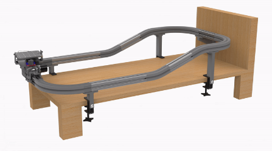

# ME461-Vehicular-Lab-Automation-Device
<b>Boston University ENG 2023: Senior Capstone</b> 

     

Team VLAD Members:

- Adam Bahlous-Boldi
- Miguel Ianus-Valdivia
- Kyle Fieleke
- Vlad Pyltsov
- Abin Binoy George

## Individual Peripherals
This folder contains framework code to control the following peripherals:
- DC Motor
- Infrared Sensor
- Encoder
- Servo Motor
- IMU

## Previous Versions
This folder contains older versions of the truck algorithm. They are stable versions lacking some functionality the final version has.

## Tilting Platform
This folder contains the control algorithm to stabilize a tilting platform.

## Truck Main
This folder contains the systems code to move the truck along the track.

## VLAD
This folder contains the main code for the GUI. It contains frameworks to plot and communicate via UDP to the microcontroller.

<b> More information to come</b>
